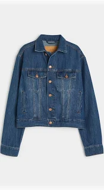
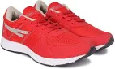
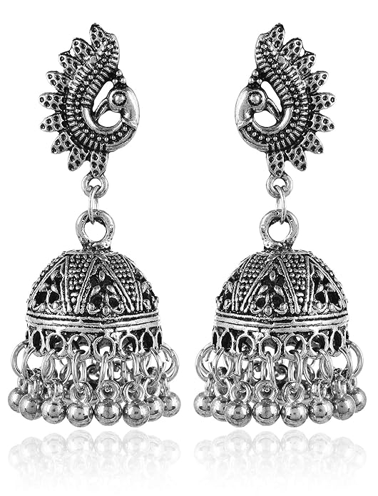

# Fashion Classification Examples

## Correct Predictions

### Example 1: Men's Blue Jacket

- **Gender:** Men
- **Article Type:** Jackets
- **Base Colour:** Blue
- **Season:** Summer
- **Notes:** Multi-attribute classification result

### Example 2: Men's Red Sports Shoes

- **Gender:** Men
- **Article Type:** Sports Shoes
- **Base Colour:** Red
- **Season:** Summer

## Challenging Cases

### Example 3: Women's Silver Necklace

- **Gender:** Women
- **Article Type:** Necklace and Chains
- **Base Colour:** Silver
- **Season:** Fall
